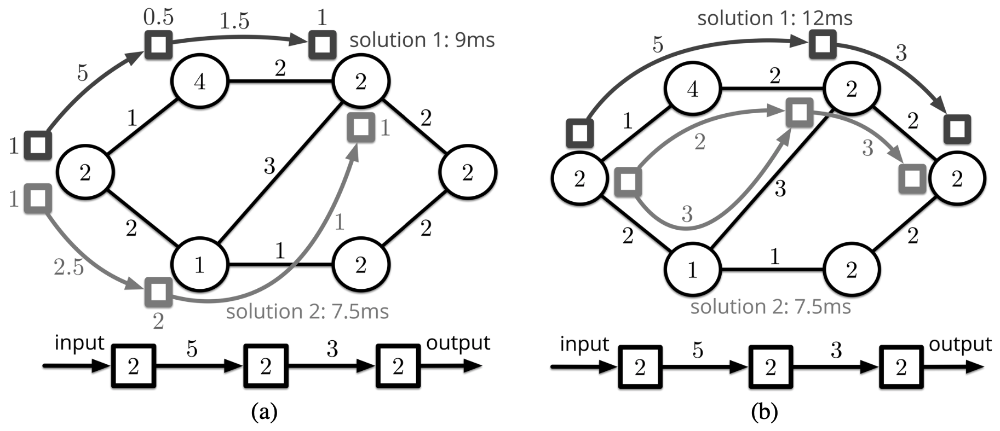
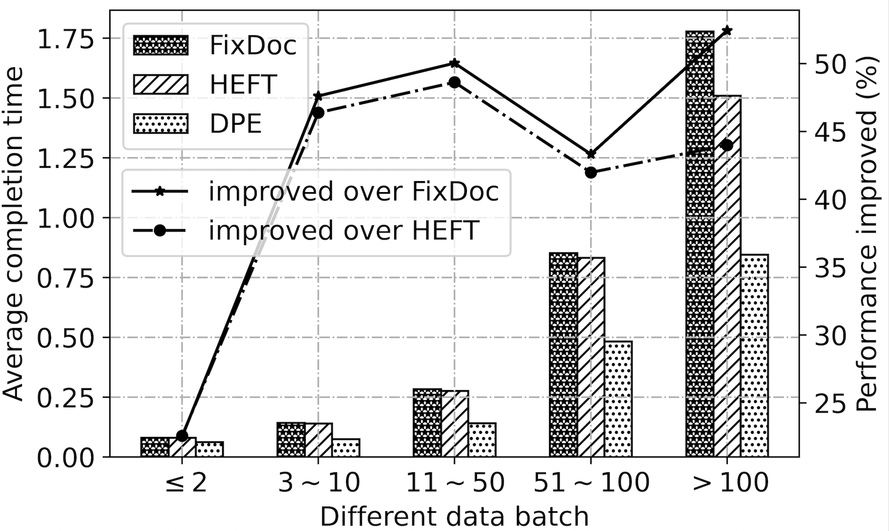

# Dependent Function Embedding
[](https://github.com/hliangzhao/Dependent-Function-Embedding/blob/master/LICENSE.txt)

``embedding`` is a python3 package for solving the dependent function embedding problems.

Dependent function embedding is the combination of **function placement** and **stream mapping** 
on the heterogenous edge. Function placement studies how the dependent functions in an app 
(abstracted as a DAG) are placed on edge servers to minimize the makespan. Stream mapping 
studies how the data stream transferred between each function pair are mapped to different 
links between edge servers.

<div align=center>
    
</div>


``embedding`` implements the algorithm DPE (Dynamic Programming-based Embedding) proposed in this paper
and two contrastive algorithms, FixDoc (https://dl.acm.org/doi/10.1145/3326285.3329055) and 
HEFT (https://ieeexplore.ieee.org/document/993206).

## Installation
You can run this code directly by downloading this repos into your desktop PC. 

To install ``embedding`` by source code, download this repository and sequentially run following 
commands in your terminal/command line:
```commandline
python setup.py build
python setup.py install --record files.txt
```
If you want to uninstall this package, please run the following command in the same directory. 
For linux/macOS:
```commandline
xargs rm -rf < files.txt
```
For windows powershell:
```commandline
Get-Content files.txt | ForEach-Object {Remove-Item $_ -Recurse -Force}
```
You can permanently uninstall this package by **further** deleting the directory 
``../lib/python3.x/site-packages/embedding-0.1.egg/``.


## A simple example
Our implementation is based on the Alibaba cluster trace dataset (https://github.com/alibaba/clusterdata), 
Please use the v2018 and download the file *batch_task* through 
[this link](http://clusterdata2018pubcn.oss-cn-beijing.aliyuncs.com/batch_task.tar.gz). 
**The package does not include this file because it's too large.** In default file path settings, 
you may put the uncompressed file into the directory ``embedding/dataset/``.

The example consists of three steps. Firstly, sampling DAGs from the batch_task.csv file and 
get the topological order for each DAG. 
```python
from embedding.dataset_processing import sample_DAG, get_topological_order

sample_DAG(batch_task.csv-file-path, sampled-DAG-path)
get_topological_order(sampled-DAG-path, sorted-DAG-path)
```
Secondly, generate the edge computing scenario, i.e., a connected graph of edge servers,
including the connectivity, processing power of each server, and bandwidth of each physical link.
```python
from embedding.scenario import *

G, bw, pp = generate_scenario()
print_scenario(G, bw, pp)
simple_paths = get_simple_paths(G)
print_simple_paths(simple_paths)
reciprocals_list, proportions_list = get_ratio(simple_paths, bw)
pp_required, data_stream = set_funcs()
```
Thirdly, run the three algorithms and compare the results. The code below prints the 2011th 
DAG's scheduling results.
```python
from embedding.algos.dpe import DPE
from embedding.algos.fixdoc import FixDoc
from embedding.algos.heft import HEFT
from embedding.algos.interpretate_result import *
from embedding.parameters import *

dpe = DPE(G, bw, pp, simple_paths, reciprocals_list, proportions_list, pp_required, data_stream)
T_optimal_all_dpe, DAGs_deploy_dpe, process_sequence_all_dpe, start_time_all_dpe = dpe.get_response_time(sorted_DAG_path=SORTED_DAG_PATH)
print_scheduling_results(T_optimal_all_dpe, DAGs_deploy_dpe, process_sequence_all_dpe, start_time_all_dpe, 2010)

fixdoc = FixDoc(G, bw, pp, simple_paths, reciprocals_list, proportions_list, pp_required, data_stream)
T_optimal_all_fixdoc, DAGs_deploy_fixdoc, process_sequence_all_fixdoc, start_time_all_fixdoc = fixdoc.get_response_time(sorted_DAG_path=SORTED_DAG_PATH)
print_scheduling_results(T_optimal_all_fixdoc, DAGs_deploy_fixdoc, process_sequence_all_fixdoc, start_time_all_fixdoc, 2010)

heft = HEFT(G, bw, pp, simple_paths, reciprocals_list, proportions_list, pp_required, data_stream)
DAGs_orders, DAGs_deploy = heft.get_response_time(sorted_DAG_path=SORTED_DAG_PATH)
print('\nThe finish time of each function on the chosen server for DAG #%d:' % 2010)
pprint.pprint(DAGs_orders[2010])
```
Below gives a typical output of makespan:
```
Getting makespan for 2119 DAGs by DPE algorithm...
100% [##################################################]
The overall makespan achieved by DPE: 1669.287308 second
The average makespan: 0.787771 second

Getting makespan for 2119 DAGs by FixDoc algorithm...
100% [##################################################]
The overall makespan achieved by FixDoc: 2327.992703 second
The average makespan: 1.098628 second

Getting makespan for 2119 DAGs by HEFT algorithm...
100% [##################################################]
The overall makespan achieved by HEFT: 2059.056025 second
The average makespan: 0.971711 second
```

You can directly run ``example/example.py`` to obtain the results. Our experiments show that 
DPE outperforms these algorithms significantly.
<div align=center>
    
</div>


The corresponding paper can be found at https://arxiv.org/abs/2012.04158. I will update the paper and the code in the following days.

About the author: 
[Hailiang Zhao @ ZJU.CS.CCNT](http://hliangzhao.me)